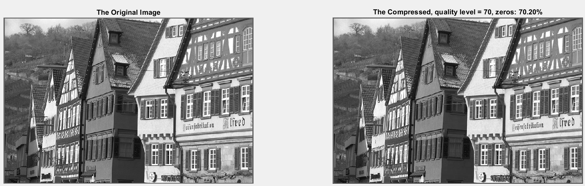

# Image Compression using DCT  

  <i>Figure 1: Sample Compressed Image, virtually no difference but about three times smaller!</i>

 

#### This project demonstrates image compression using the **Discrete Cosine Transform (DCT)**. The implementation allows for compressing images by controlling the quality level and visualizing the results.

## How to Run the Code

1. Run the main script: **`RunME.m`**.
2. Ensure all the supporting `.m` files are in the same directory as the main script. These files are essential for the compression process.

## Supporting Functions

- **`CompressImage.m`**  
  Takes a single-channel image matrix (grayscale) and a desired quality level, then outputs the compressed image along with the percentage of zero coefficients in the DCT of the compressed image.

- **`compress.m`**  
  Applies DCT-based compression to an 8x8 block of the image.

- **`Q_mat.m`**  
  Generates the quantization matrix based on the specified quality level.

- **`PSNR.m`**  
  Calculates the Peak Signal-to-Noise Ratio (PSNR) between the original image and the compressed (reconstructed) image. This is a common metric to evaluate compression quality.

